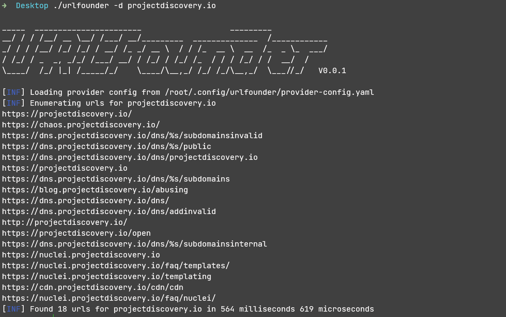

fork from https://github.com/projectdiscovery/subfinder

# intro

<h4 align="center">Fast passive url enumeration tool.</h4>

<p align="center">
  <a href="#features">Features</a> •
  <a href="#installation">Install</a> •
  <a href="#running-urlfounder">Usage</a> •
  <a href="#post-installation-instructions">API Setup</a> •
  <a href="#urlfounder-go-library">Library</a> •
  <a href="#wiki">Wiki</a>
</p>
---

`urlfounder` is a url discovery tool that returns valid urls for domain, using passive online sources. 

# Features

<h1 align="left">
  </a>
  <br>
</h1>

- Probe and extract key information, such as title, status code
- Support for multiple output formats (JSON, file, standard output)
- Multiple data sources to maximise coverage and accuracy of search results
- Fast and lightweight
- Bulk input support

# Usage

```
urlfounder -h
```

This will display help for the tool. Here are all the switches it supports.

```
Usage:
  ./urlfounder [flags]

Flags:
INPUT:
   -d, -domain string[]  domains to find urls for
   -dL, -list string     file containing list of domains for url discovery

SOURCE:
   -s, -sources string[]           specific sources to use for discovery. Use -ls to display all available sources.
   -all                            use all sources for enumeration (slow)
   -es, -exclude-sources string[]  sources to exclude from enumeration (-es alienvault,zoomeye)


FILTER:
   -m, -match string[]   url or list of url to match (file or comma separated)
   -f, -filter string[]   url or list of url to filter (file or comma separated)

RATE-LIMIT:
   -rl, -rate-limit int  maximum number of http requests to send per second
   -t int                number of concurrent goroutines for resolving (-active 
                                                                                only) (default 10)

OUTPUT:
   -o, -output string       file to write output to
   -oJ, -json               write output in JSONL(ines) format
   -oD, -output-dir string  directory to write output (-dL only)
   -cs, -collect-sources    include all sources in the output (-json only)      
   -silent             show only urls in output
   -version            show version of urlfounder
   -v                  show verbose output
   -nc, -no-color      disable color in output
   -ls, -list-sources  list all available sources
   -stats              report source statistics

OPTIMIZATION:
   -timeout int   seconds to wait before timing out (default 30)
   -max-time int  minutes to wait for enumeration results (default 10)


Process finished with the exit code 0
   -silent             show only urls in output
   -version            show version of urlfounder
   -v                  show verbose output
   -nc, -no-color      disable color in output
   -ls, -list-sources  list all available sources
   -stats              report source statistics

OPTIMIZATION:
   -timeout int   seconds to wait before timing out (default 30)
   -max-time int  minutes to wait for enumeration results (default 10)
```

# Installation

`urlfounder`requires **go1.19** to install successfully.

## Post Installation Instructions

You can use the `urlfounder -ls` command to display all the available sources.

The following services require set http proxy to use：

- webarchive
- alienvault

The following services require configuring API keys to work:

- [BeVigil](https://bevigil.com/osint-api)

These values are stored in the `$HOME/.config/urlfounder/provider-config.yaml` file which will be created when you run the tool for the first time. 

An example provider config file:

```
alienvault: []
bevigil:
  - Tu8DSd6GqM1jDDDD
webarchive: []
```

# Running Urlfounder

To run the tool on a target, just use the following command.

```console
urlfounder -d guancha.cn               

_____  _______________________                   _________            
__/ / / /__/ __ \__/ /___/ __/_________  ______________  /____________
_/ / / /__/ /_/ /_/ / __/ /_ _/ __ \  / / /_  __ \  __  /_  _ \_  ___/
/ /_/ / _  _, _/_/ /___/ __/ / /_/ / /_/ /_  / / / /_/ / /  __/  /    
\____/  /_/ |_| /_____/_/    \____/\__,_/ /_/ /_/\__,_/  \___//_/   V0.0.1


[INF] Enumerating urls for guancha.cn

http://www.guancha.cn/xianggangpuxuan/2014_10_05_273239.shtml
http://www.guancha.cn/third-world/2014_08_22_259264.shtml
http://www.guancha.cn/third-world/2014_09_03_263371.shtml
http://www.guancha.cn/europe/2014_08_22_259307.shtml
http://guancha.cn
http://www.guancha.cn/broken-news/2014_08_22_259268.shtml
http://m.guancha.cn/
http://www.guancha.cn/third-world/2014_08_15_256903_3.shtml
http://www.guancha.cn/local/2014_08_07_254312.shtml
http://www.guancha.cn/neighbors/2014_09_16_267550.shtml

[INF] Found 10 urls for guancha.cn in 1 second 228 milliseconds
```

## Urlfounder Go library

Usage example：

```
package main

import (
	"bytes"
	"fmt"
	"github.com/chainreactors/urlfounder/v2/pkg/resolve"
	"github.com/chainreactors/urlfounder/v2/pkg/runner"
	"io"
	"log"
)

func main() {
	runnerInstance, err := runner.NewRunner(&runner.Options{
		Threads:            10,                       // Thread controls the number of threads to use for active enumerations
		Timeout:            30,                       // Timeout is the seconds to wait for sources to respond
		MaxEnumerationTime: 10,                       // MaxEnumerationTime is the maximum amount of time in mins to wait for enumeration
		Resolvers:          resolve.DefaultResolvers, // Use the default list of resolvers by marshaling it to the config
		ResultCallback: func(s *resolve.HostEntry) { // Callback function to execute for available host
			log.Println(s.Host, s.Source)
		},
	})

	buf := bytes.Buffer{}
	err = runnerInstance.EnumerateSingleDomain("projectdiscovery.io", []io.Writer{&buf})
	if err != nil {
		log.Fatal(err)
	}

	data, err := io.ReadAll(&buf)
	if err != nil {
		log.Fatal(err)
	}

	fmt.Printf("%s", data)
}
```

</td>
</tr>
</table>

### Wiki

- [Look at me !!!](https://chainreactors.github.io/wiki/)

# THANKS

- [urlfounder](https://github.com/chainreactors/urlfounder)
